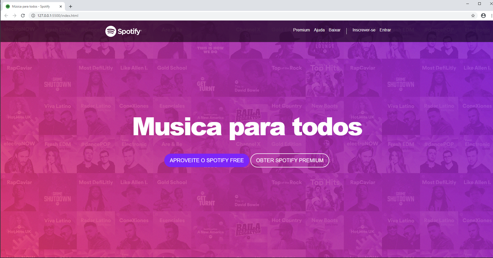
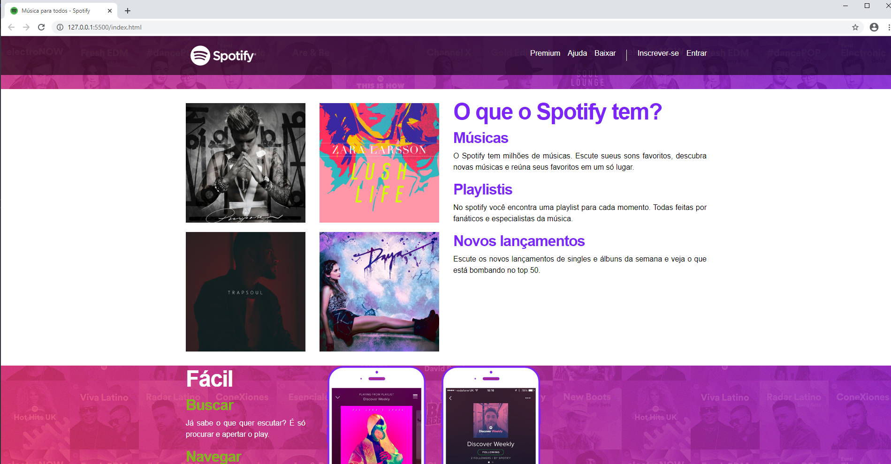
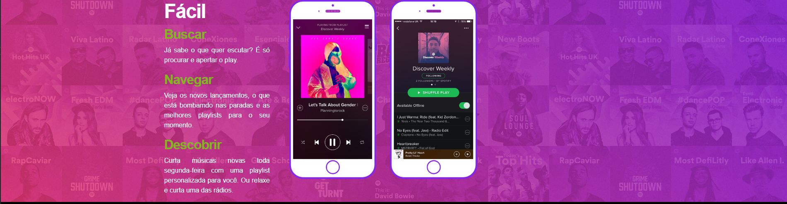

# Project Title

Final project about front end html5 and css3. This is an a old version.
   

## Getting Started

There are no many prerequisites for this application. My suggestion is to use a Visual Studio Code.

* [Visual Studio Code] (https://code.visualstudio.com/)
* [Bootstrap] (https://getbootstrap.com/) - Extension that I use, version 4.
* [Font Awesome] (https://fontawesome.com/) - Icon kit that I used, an a external script link.
   

   

## Deployment
There are no deploy of this code, because this is only part of front end course.

## License

This project is licensed under the MIT License - see the file for details.
 

