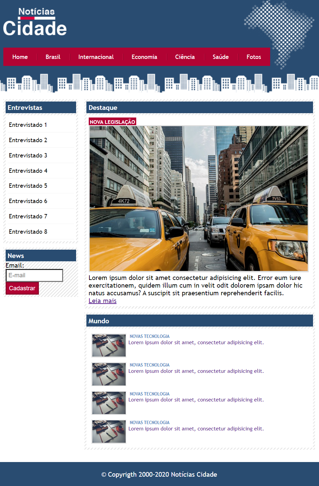

<h1 align="center">
        
</h1>

    This is a simple project, that i builded using just html5 and css3.
    is just abou a notice local blog, whit some links and fictitious articles
           
    
    

📂 About 
Project made by myself using VSCode, html5 and css3. This is a project part at the course developer full stack in udemy academy. I'm not using advanced html5 codes, I'm using some div's h1's and the usual strutcture de html, whit body, title... I'm using external link for css and images. let me show one little bit part of code:
   

💻 Used tecnologies:

- [HTML5]
- [CSS3]

