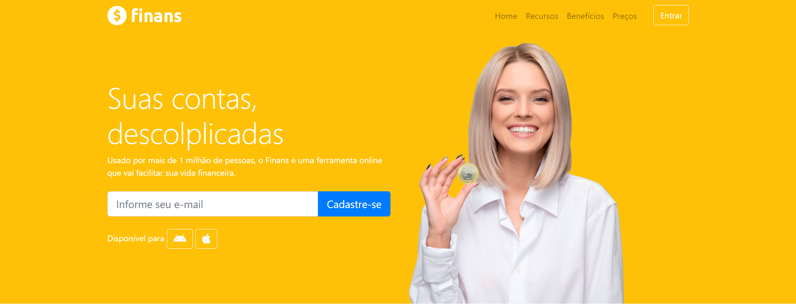

# Project Title

Web page similar of the aplication personal financial.
 

## Getting Started

There are no many prerequisites for this application. My suggestion is to use a Visual Studio Code.

[Visual Studio Code] (https://code.visualstudio.com/)
[Bootstrap] (https://getbootstrap.com/) - Extension that I use, version 4.
[Font Awesome] (https://fontawesome.com/) - Icon kit that I used, an a external script link. 

## Deployment
There are no deploy of this code, because this is only part of front end course.

participated in this project.

## License

This project is licensed under the MIT License - see the [LICENSE.md](LICENSE.md) file for details